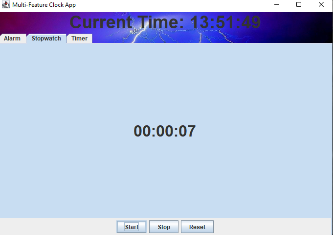

# Clock App with Alarm, Stopwatch, and Timer

## Overview

This is a **Clock Application** that provides features commonly found in modern clock apps, including:

* **Current Time Display**: Shows the current time in hours, minutes, and seconds.
* **Alarm**: Set an alarm to beep at a specified time.
* **Stopwatch**: A simple stopwatch with start, stop, and reset functionality.
* **Timer**: A countdown timer that lets you specify the number of seconds to countdown.

The app has a beautiful background image and is designed to be interactive and easy to use.

## Features

### 1. **Current Time**

* The clock continuously displays the current time in the format `HH:mm:ss`.
* The time is updated every second, and the clock is synchronized with the system time.

### 2. **Alarm**

* You can set an alarm time in the format `HH:mm:ss`.
* When the current time matches the set alarm time, the app will beep to notify you.

### 3. **Stopwatch**

* Start, stop, and reset the stopwatch.
* The stopwatch tracks time from zero in seconds and displays it in the format `HH:mm:ss`.

### 4. **Timer**

* Set a countdown timer by entering the number of seconds.
* The timer will count down to zero, and when the time is up, it will beep and notify you.

## Screenshots

### 1. **Alarm Feature**

The alarm allows you to set a specific time, and when that time is reached, the app will beep.


### 2. **Stopwatch Feature**

The stopwatch feature enables you to start, stop, and reset the stopwatch. It displays elapsed time in `HH:mm:ss` format.



### 3. **Timer Feature**

The timer allows you to set a countdown in seconds. When the timer reaches zero, it will beep to notify you.


## Requirements

* Java 8 or higher (JDK).
* IDE or terminal to run the Java application (e.g., IntelliJ IDEA, Eclipse, or terminal with `javac` and `java` commands).
* Background image `1096112.jpg` for the GUI background.

## Installation and Running the Application

### 1. **Clone the Repository**

Clone the repository or download the `Clock.java` file to your local machine.

```bash
git clone https://github.com/kerthnorth/clock-app.git
```

### 2. **Compile the Java Code**

Navigate to the directory where `Clock.java` is saved and compile the code.

```bash
javac Clock.java
```

### 3. **Run the Application**

After compilation, you can run the app using the following command:

```bash
java Clock
```

### 4. **Setting Up the Background Image**

Make sure that you have the background image (`1096112.jpg`) in the same directory as your Java file or update the path in the code to point to the correct location of the image.

### 5. **Setting the Alarm**

* To set an alarm, enter the desired time in the format `HH:mm:ss` in the text field and click "Set Alarm".
* The alarm will beep when the current time matches the set alarm time.

### 6. **Using the Stopwatch**

* Click "Start" to begin the stopwatch, "Stop" to pause it, and "Reset" to reset it to zero.

### 7. **Using the Timer**

* Enter the number of seconds you want to countdown and click "Start Timer".
* The timer will countdown to zero, and a beep will sound when the timer ends.

## How to Use the App

1. **Start the app**: When you open the app, the current time will be displayed at the top of the screen.
2. **Set an alarm**: In the Alarm tab, enter the time you want for the alarm and click the "Set Alarm" button.
3. **Use the Stopwatch**: Click the "Start" button to begin the stopwatch, and use "Stop" or "Reset" as needed.
4. **Use the Timer**: In the Timer tab, enter the number of seconds, click "Start Timer," and the countdown will begin.

